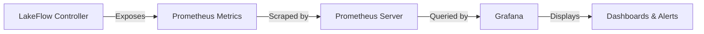

# Grafana Dashboard Configuration Guide for Lakeflow-Controller Metrics

This guide provides comprehensive instructions for configuring metrics-based dashboards in Grafana to monitor LakeFlow operations.

## Table of Contents

1. [Overview](#overview)
2. [Prerequisites](#prerequisites)
3. [Available Metrics](#available-metrics)
4. [Prometheus Configuration](#prometheus-configuration)
5. [Grafana Data Source Setup](#grafana-data-source-setup)
6. [Dashboard Configuration](#dashboard-configuration)
7. [Example Dashboards](#example-dashboards)
8. [PromQL Query Examples](#promql-query-examples)
9. [Visualization Best Practices](#visualization-best-practices)
10. [Troubleshooting](#troubleshooting)

---

## Overview

Lakeflow-controller exposes Prometheus metrics for monitoring workflow execution, task performance, resource utilization, and retry behavior. These metrics enable comprehensive observability for data processing pipelines running on Kubernetes.

### Metrics Architecture



---

## Prerequisites

### Required Components

1. **Kubernetes Cluster** (v1.11.3+)
2. **Lakeflow-controller** deployed with metrics enabled
3. **Prometheus Operator** or Prometheus Server
4. **Grafana** (v8.0+)

### Verify Metrics Endpoint

Check that the metrics service is running:

```bash
kubectl get svc -n lakeflow-controller-system controller-manager-metrics-service
```

Test metrics endpoint (port-forward):

```bash
kubectl port-forward -n lakeflow-controller-system svc/controller-manager-metrics-service 8443:8443
curl -k https://localhost:8443/metrics
```

---

## Available Metrics

Lakeflow-controller exposes the following Prometheus metrics:

### Workflow-Level Metrics

#### 1. `lake_workflow_transition_timestamp_seconds` (Gauge)

Timestamp of the last state transition for a LakeFlow.

**Labels:**
- `namespace`: Kubernetes namespace
- `workflow`: Workflow name
- `phase`: Current workflow phase (Pending, Idle, Running, Succeeded, Failed, Completed)

**Use Cases:**
- Track workflow state changes over time
- Calculate time spent in each phase
- Identify stuck workflows

#### 2. `lake_workflow_duration_seconds` (Histogram)

Total runtime of a workflow from creation to completion.

**Labels:**
- `namespace`: Kubernetes namespace
- `workflow`: Workflow name
- `phase`: Final phase (Succeeded, Failed)

**Buckets:** Exponential buckets starting at 10s, doubling 14 times (covers up to ~45 hours)

**Use Cases:**
- Analyze workflow execution time distribution
- Set SLOs for workflow completion
- Identify performance degradation

#### 3. `lake_workflow_retry_total` (Counter)

Total number of workflow retry attempts.

**Labels:**
- `namespace`: Kubernetes namespace
- `workflow`: Workflow name

**Use Cases:**
- Monitor workflow reliability
- Alert on excessive retries
- Track retry patterns

### Task-Level Metrics

#### 4. `lake_workflow_task_duration_seconds` (Histogram)

Runtime of individual tasks from start to completion.

**Labels:**
- `namespace`: Kubernetes namespace
- `workflow_name`: Parent workflow name
- `task_name`: Task name
- `phase`: Task completion phase (Succeeded, Failed, Error, Skipped)

**Buckets:** Exponential buckets starting at 1s, doubling 15 times (covers up to ~9 hours)

**Use Cases:**
- Identify slow tasks
- Compare task performance across workflows
- Optimize task resource allocation

#### 5. `lake_workflow_task_ready_timestamp_seconds` (Gauge)

Timestamp when a task became ready (started execution).

**Labels:**
- `namespace`: Kubernetes namespace
- `workflow_name`: Parent workflow name
- `task_name`: Task name

**Use Cases:**
- Calculate task scheduling latency
- Monitor task queue wait times
- Identify scheduling bottlenecks

#### 6. `lake_workflow_task_completion_timestamp_seconds` (Gauge)

Timestamp when a task completed execution.

**Labels:**
- `namespace`: Kubernetes namespace
- `workflow_name`: Parent workflow name
- `task_name`: Task name
- `phase`: Completion phase

**Use Cases:**
- Track task completion times
- Calculate end-to-end task duration
- Monitor task execution patterns

#### 7. `lake_workflow_task_retry_total` (Counter)

Total number of task retry attempts.

**Labels:**
- `namespace`: Kubernetes namespace
- `workflow_name`: Parent workflow name
- `task_name`: Task name

**Use Cases:**
- Identify unreliable tasks
- Monitor retry patterns
- Alert on excessive task failures

### Resource Metrics

#### 8. `lake_workflow_task_resource_requests` (Gauge)

Resource requests for tasks (CPU in cores, memory in MB).

**Labels:**
- `namespace`: Kubernetes namespace
- `workflow_name`: Parent workflow name
- `task_name`: Task name
- `queue`: Volcano queue name
- `resource`: Resource type (cpu, memory)

**Use Cases:**
- Monitor resource allocation
- Optimize resource requests
- Track resource usage by queue

#### 9. `lake_workflow_task_resource_limits` (Gauge)

Resource limits for tasks (CPU in cores, memory in MB).

**Labels:**
- `namespace`: Kubernetes namespace
- `workflow_name`: Parent workflow name
- `task_name`: Task name
- `queue`: Volcano queue name
- `resource`: Resource type (cpu, memory)

**Use Cases:**
- Monitor resource limits
- Prevent resource over-allocation
- Track resource constraints

---

## Prometheus Configuration

### ServiceMonitor Configuration

Lakeflow-controller includes a ServiceMonitor for automatic Prometheus discovery:

```yaml
apiVersion: monitoring.coreos.com/v1
kind: ServiceMonitor
metadata:
  name: controller-manager-metrics-monitor
  namespace: lakeflow-controller-system
spec:
  endpoints:
    - path: /metrics
      port: https
      scheme: https
      bearerTokenFile: /var/run/secrets/kubernetes.io/serviceaccount/token
      tlsConfig:
        insecureSkipVerify: true
  selector:
    matchLabels:
      control-plane: controller-manager
      app.kubernetes.io/name: lakeflow-controller
```

### Manual Prometheus Configuration

If not using Prometheus Operator, add this scrape config:

```yaml
scrape_configs:
  - job_name: 'lakeflow-controller'
    kubernetes_sd_configs:
      - role: service
        namespaces:
          names:
            - lakeflow-controller-system
    relabel_configs:
      - source_labels: [__meta_kubernetes_service_label_control_plane]
        action: keep
        regex: controller-manager
      - source_labels: [__meta_kubernetes_service_label_app_kubernetes_io_name]
        action: keep
        regex: lakeflow-controller
    scheme: https
    tls_config:
      insecure_skip_verify: true
    bearer_token_file: /var/run/secrets/kubernetes.io/serviceaccount/token
```

### Verify Prometheus Targets

Check that Prometheus is scraping lakeflow-controller metrics:

```bash
# Access Prometheus UI
kubectl port-forward -n monitoring svc/prometheus-k8s 9090:9090

# Navigate to: http://localhost:9090/targets
# Look for: lakeflow-controller or controller-manager-metrics
```

---

## Grafana Data Source Setup

### Add Prometheus Data Source

1. Navigate to **Configuration** → **Data Sources**
2. Click **Add data source**
3. Select **Prometheus**
4. Configure:
   - **Name:** `Prometheus`
   - **URL:** `http://prometheus-k8s.monitoring.svc:9090` (adjust for your setup)
   - **Access:** `Server (default)`
5. Click **Save & Test**

### Kubernetes Service Discovery

If Grafana runs in the same cluster:

```yaml
apiVersion: v1
kind: ConfigMap
metadata:
  name: grafana-datasources
  namespace: monitoring
data:
  prometheus.yaml: |
    apiVersion: 1
    datasources:
      - name: Prometheus
        type: prometheus
        access: proxy
        url: http://prometheus-k8s.monitoring.svc:9090
        isDefault: true
        editable: false
```

---

## Dashboard Configuration

### Dashboard Structure

A comprehensive LakeFlow dashboard should include:

1. **Overview Panel** - High-level workflow statistics
2. **Workflow Execution Panel** - Workflow duration and success rates
3. **Task Performance Panel** - Task execution times and failures
4. **Resource Utilization Panel** - CPU and memory usage
5. **Retry Analysis Panel** - Workflow and task retry patterns
6. **Queue Metrics Panel** - Resource allocation by queue

### Dashboard Variables

Define these variables for dynamic filtering:

```json
{
  "templating": {
    "list": [
      {
        "name": "namespace",
        "type": "query",
        "datasource": "Prometheus",
        "query": "label_values(lake_workflow_transition_timestamp_seconds, namespace)",
        "multi": true,
        "includeAll": true
      },
      {
        "name": "workflow",
        "type": "query",
        "datasource": "Prometheus",
        "query": "label_values(lake_workflow_transition_timestamp_seconds{namespace=~\"$namespace\"}, workflow)",
        "multi": true,
        "includeAll": true
      },
      {
        "name": "queue",
        "type": "query",
        "datasource": "Prometheus",
        "query": "label_values(lake_workflow_task_resource_requests, queue)",
        "multi": true,
        "includeAll": true
      }
    ]
  }
}
```

---

## Example Dashboards

### Dashboard 1: Workflow Overview

**Purpose:** High-level monitoring of all workflows

**Panels:**

#### Panel 1: Active Workflows by Phase (Stat)

```promql
count by (phase) (
  lake_workflow_transition_timestamp_seconds{namespace=~"$namespace"}
)
```

**Visualization:** Stat panel with color thresholds
- Green: Succeeded
- Blue: Running
- Yellow: Pending
- Red: Failed

#### Panel 2: Workflow Success Rate (Gauge)

```promql
sum(rate(lake_workflow_duration_seconds_count{phase="Succeeded", namespace=~"$namespace"}[5m])) /
sum(rate(lake_workflow_duration_seconds_count{namespace=~"$namespace"}[5m])) * 100
```

**Visualization:** Gauge (0-100%)
- Thresholds: <80% (red), 80-95% (yellow), >95% (green)

#### Panel 3: Workflow Execution Timeline (Time Series)

```promql
count by (phase) (
  changes(lake_workflow_transition_timestamp_seconds{namespace=~"$namespace"}[1m])
)
```

**Visualization:** Time series graph with stacked area

#### Panel 4: Average Workflow Duration (Stat)

```promql
avg(rate(lake_workflow_duration_seconds_sum{namespace=~"$namespace"}[5m]) /
    rate(lake_workflow_duration_seconds_count{namespace=~"$namespace"}[5m]))
```

**Visualization:** Stat panel with unit "s" (seconds)

### Dashboard 2: Task Performance Analysis

**Purpose:** Detailed task execution monitoring

#### Panel 1: Task Duration Heatmap

```promql
sum(rate(lake_workflow_task_duration_seconds_bucket{namespace=~"$namespace", workflow_name=~"$workflow"}[5m])) by (le)
```

**Visualization:** Heatmap
- X-axis: Time
- Y-axis: Duration buckets
- Color: Task count

#### Panel 2: Top 10 Slowest Tasks (Bar Gauge)

```promql
topk(10,
  avg by (task_name, workflow_name) (
    rate(lake_workflow_task_duration_seconds_sum{namespace=~"$namespace"}[5m]) /
    rate(lake_workflow_task_duration_seconds_count{namespace=~"$namespace"}[5m])
  )
)
```

**Visualization:** Bar gauge (horizontal)

#### Panel 3: Task Failure Rate (Time Series)

```promql
sum by (task_name) (
  rate(lake_workflow_task_duration_seconds_count{phase=~"Failed|Error", namespace=~"$namespace"}[5m])
)
```

**Visualization:** Time series with alert threshold line

#### Panel 4: Task Scheduling Latency (Time Series)

```promql
(
  lake_workflow_task_completion_timestamp_seconds{namespace=~"$namespace"} -
  lake_workflow_task_ready_timestamp_seconds{namespace=~"$namespace"}
)
```

**Visualization:** Time series graph

### Dashboard 3: Resource Utilization

**Purpose:** Monitor resource allocation and usage

#### Panel 1: CPU Requests by Queue (Stacked Area)

```promql
sum by (queue) (
  lake_workflow_task_resource_requests{resource="cpu", namespace=~"$namespace", queue=~"$queue"}
)
```

**Visualization:** Time series (stacked area chart)

#### Panel 2: Memory Requests by Queue (Stacked Area)

```promql
sum by (queue) (
  lake_workflow_task_resource_requests{resource="memory", namespace=~"$namespace", queue=~"$queue"}
)
```

**Visualization:** Time series (stacked area chart)

#### Panel 3: Resource Utilization Ratio (Gauge)

```promql
sum(lake_workflow_task_resource_requests{resource="cpu", namespace=~"$namespace"}) /
sum(lake_workflow_task_resource_limits{resource="cpu", namespace=~"$namespace"}) * 100
```

**Visualization:** Gauge (0-100%)

#### Panel 4: Top Resource Consumers (Table)

```promql
topk(20,
  sum by (workflow_name, task_name, queue) (
    lake_workflow_task_resource_requests{resource="cpu", namespace=~"$namespace"}
  )
)
```

**Visualization:** Table with columns:
- Workflow Name
- Task Name
- Queue
- CPU Requests
- Memory Requests

### Dashboard 4: Retry Analysis

**Purpose:** Monitor and analyze retry patterns

#### Panel 1: Workflow Retry Rate (Time Series)

```promql
sum by (workflow) (
  rate(lake_workflow_retry_total{namespace=~"$namespace"}[5m])
)
```

**Visualization:** Time series graph

#### Panel 2: Task Retry Rate (Time Series)

```promql
sum by (task_name) (
  rate(lake_workflow_task_retry_total{namespace=~"$namespace", workflow_name=~"$workflow"}[5m])
)
```

**Visualization:** Time series graph

#### Panel 3: Most Retried Tasks (Bar Chart)

```promql
topk(10,
  sum by (task_name, workflow_name) (
    increase(lake_workflow_task_retry_total{namespace=~"$namespace"}[1h])
  )
)
```

**Visualization:** Bar chart (horizontal)

#### Panel 4: Retry Heatmap by Hour (Heatmap)

```promql
sum by (hour) (
  increase(lake_workflow_task_retry_total{namespace=~"$namespace"}[1h])
)
```

**Visualization:** Heatmap
- X-axis: Time
- Y-axis: Hour of day
- Color: Retry count

---

## PromQL Query Examples

### Workflow Queries

#### Calculate workflow phase duration

```promql
# Time spent in Running phase
(
  lake_workflow_transition_timestamp_seconds{phase="Succeeded"} -
  lake_workflow_transition_timestamp_seconds{phase="Running"}
)
```

#### Workflow completion rate (last hour)

```promql
sum(increase(lake_workflow_duration_seconds_count{phase="Succeeded"}[1h])) /
sum(increase(lake_workflow_duration_seconds_count[1h])) * 100
```

#### P95 workflow duration

```promql
histogram_quantile(0.95,
  sum(rate(lake_workflow_duration_seconds_bucket[5m])) by (le, namespace)
)
```

#### Workflows stuck in Running phase (>1 hour)

```promql
count(
  (time() - lake_workflow_transition_timestamp_seconds{phase="Running"}) > 3600
)
```

### Task Queries

#### Average task duration by executor type

```promql
avg by (task_name) (
  rate(lake_workflow_task_duration_seconds_sum[5m]) /
  rate(lake_workflow_task_duration_seconds_count[5m])
)
```

#### Task failure rate (percentage)

```promql
sum(rate(lake_workflow_task_duration_seconds_count{phase=~"Failed|Error"}[5m])) /
sum(rate(lake_workflow_task_duration_seconds_count[5m])) * 100
```

#### Tasks with high retry rates

```promql
topk(10,
  sum by (task_name, workflow_name) (
    rate(lake_workflow_task_retry_total[5m])
  )
) > 0.1
```

#### Task queue wait time

```promql
(
  lake_workflow_task_ready_timestamp_seconds -
  on(namespace, workflow_name) group_left
  lake_workflow_transition_timestamp_seconds{phase="Running"}
)
```

### Resource Queries

#### Total CPU requests across all workflows

```promql
sum(lake_workflow_task_resource_requests{resource="cpu"})
```

#### Memory utilization by queue

```promql
sum by (queue) (
  lake_workflow_task_resource_requests{resource="memory"}
) / 1024
```

#### Resource over-commitment ratio

```promql
sum(lake_workflow_task_resource_requests{resource="cpu"}) /
sum(lake_workflow_task_resource_limits{resource="cpu"})
```

#### Tasks exceeding resource limits

```promql
count(
  lake_workflow_task_resource_requests{resource="cpu"} >
  lake_workflow_task_resource_limits{resource="cpu"}
)
```

### Advanced Queries

#### Workflow SLO compliance (95% complete within 1 hour)

```promql
(
  sum(rate(lake_workflow_duration_seconds_bucket{le="3600"}[5m])) /
  sum(rate(lake_workflow_duration_seconds_count[5m]))
) * 100 >= 95
```

#### Detect workflow anomalies (duration > 2x average)

```promql
(
  rate(lake_workflow_duration_seconds_sum[5m]) /
  rate(lake_workflow_duration_seconds_count[5m])
) > 2 * (
  avg_over_time(
    (rate(lake_workflow_duration_seconds_sum[5m]) /
     rate(lake_workflow_duration_seconds_count[5m]))[1h:]
  )
)
```

#### Task dependency chain duration

```promql
sum by (workflow_name) (
  lake_workflow_task_completion_timestamp_seconds -
  lake_workflow_task_ready_timestamp_seconds
)
```

---

## Visualization Best Practices

### Panel Selection Guide

| Metric Type | Recommended Visualization | Use Case |
|-------------|---------------------------|----------|
| Counters (rate) | Time Series | Trend analysis over time |
| Gauges (current value) | Stat / Gauge | Current state display |
| Histograms (quantiles) | Heatmap / Graph | Distribution analysis |
| Aggregations (sum/avg) | Bar Chart / Table | Comparison across dimensions |
| Ratios (percentage) | Gauge / Stat | SLO monitoring |

### Color Schemes

#### Workflow Phases

- **Pending:** Blue (#5794F2)
- **Running:** Yellow (#FADE2A)
- **Succeeded:** Green (#73BF69)
- **Failed:** Red (#F2495C)
- **Idle:** Gray (#B7B7B7)

#### Resource Utilization

- **Low (<50%):** Green
- **Medium (50-80%):** Yellow
- **High (>80%):** Orange
- **Critical (>95%):** Red

### Dashboard Layout Tips

1. **Top Row:** High-level KPIs (success rate, active workflows, avg duration)
2. **Middle Rows:** Detailed metrics (task performance, resource usage)
3. **Bottom Rows:** Troubleshooting panels (retries, failures, anomalies)

### Refresh Rates

- **Production Monitoring:** 30s - 1m
- **Development/Testing:** 5s - 15s
- **Historical Analysis:** Manual refresh

### Time Range Recommendations

- **Real-time Monitoring:** Last 15m - 1h
- **Daily Operations:** Last 6h - 24h
- **Trend Analysis:** Last 7d - 30d
- **Capacity Planning:** Last 90d

---

## Troubleshooting

### Common Issues

#### Issue 1: No Metrics Appearing in Grafana

**Symptoms:**
- Empty panels or "No data" messages
- Queries return no results

**Solutions:**

1. **Verify Prometheus is scraping metrics:**
   ```bash
   kubectl port-forward -n monitoring svc/prometheus-k8s 9090:9090
   # Check targets at http://localhost:9090/targets
   ```

2. **Check ServiceMonitor configuration:**
   ```bash
   kubectl get servicemonitor -n lakeflow-controller-system
   kubectl describe servicemonitor controller-manager-metrics-monitor -n lakeflow-controller-system
   ```

3. **Verify metrics endpoint is accessible:**
   ```bash
   kubectl port-forward -n lakeflow-controller-system svc/controller-manager-metrics-service 8443:8443
   curl -k https://localhost:8443/metrics | grep lake_workflow
   ```

4. **Check Prometheus logs:**
   ```bash
   kubectl logs -n monitoring -l app.kubernetes.io/name=prometheus
   ```

#### Issue 2: Metrics Show Incorrect Values

**Symptoms:**
- Negative durations
- Timestamps in the future
- Resource values of 0

**Solutions:**

1. **Check system time synchronization:**
   ```bash
   kubectl exec -n lakeflow-controller-system deployment/controller-manager -- date
   ```

2. **Verify metric labels are correct:**
   ```promql
   lake_workflow_transition_timestamp_seconds{namespace="your-namespace"}
   ```

3. **Check for metric resets:**
   ```promql
   resets(lake_workflow_retry_total[1h])
   ```

#### Issue 3: High Cardinality Warnings

**Symptoms:**
- Prometheus performance degradation
- "Too many samples" errors
- Slow query execution

**Solutions:**

1. **Limit label values in queries:**
   ```promql
   # Instead of:
   lake_workflow_task_duration_seconds
   
   # Use:
   lake_workflow_task_duration_seconds{namespace="production"}
   ```

2. **Use recording rules for expensive queries:**
   ```yaml
   groups:
     - name: lake_workflow_rules
       interval: 30s
       rules:
         - record: job:lake_workflow_success_rate:5m
           expr: |
             sum(rate(lake_workflow_duration_seconds_count{phase="Succeeded"}[5m])) /
             sum(rate(lake_workflow_duration_seconds_count[5m]))
   ```

3. **Implement metric retention policies:**
   ```yaml
   # In Prometheus config
   storage:
     tsdb:
       retention.time: 15d
       retention.size: 50GB
   ```

#### Issue 4: Missing Historical Data

**Symptoms:**
- Gaps in time series
- Incomplete histograms

**Solutions:**

1. **Check Prometheus retention settings:**
   ```bash
   kubectl get prometheus -n monitoring -o yaml | grep retention
   ```

2. **Verify no pod restarts during the gap:**
   ```bash
   kubectl get events -n lakeflow-controller-system --sort-by='.lastTimestamp'
   ```

3. **Check for metric cleanup:**
   ```bash
   # Metrics are cleaned up after TaskMetricsRetentionPeriod (10 minutes)
   # Ensure Prometheus scrapes before cleanup
   ```

#### Issue 5: Dashboard Performance Issues

**Symptoms:**
- Slow panel loading
- Timeout errors
- High CPU usage in Grafana

**Solutions:**

1. **Optimize query time ranges:**
   ```promql
   # Use shorter time ranges for high-cardinality queries
   rate(lake_workflow_task_duration_seconds_count[5m])  # Good
   rate(lake_workflow_task_duration_seconds_count[1h])  # May be slow
   ```

2. **Use recording rules for complex queries:**
   ```yaml
   - record: workflow:task_duration:p95
     expr: |
       histogram_quantile(0.95,
         sum(rate(lake_workflow_task_duration_seconds_bucket[5m])) by (le, workflow_name)
       )
   ```

3. **Reduce panel refresh rates:**
   - Change from 5s to 30s or 1m
   - Use manual refresh for historical analysis

4. **Implement query result caching:**
   ```yaml
   # In Grafana datasource config
   jsonData:
     queryTimeout: "60s"
     timeInterval: "30s"
   ```

### Debugging Queries

#### Test metric availability

```promql
# Check if metric exists
up{job="lakeflow-controller"}

# Count time series
count(lake_workflow_transition_timestamp_seconds)

# Check label values
label_values(lake_workflow_transition_timestamp_seconds, namespace)
```

#### Validate histogram buckets

```promql
# View all buckets
lake_workflow_duration_seconds_bucket

# Check bucket distribution
sum by (le) (lake_workflow_duration_seconds_bucket)
```

#### Debug rate calculations

```promql
# Raw counter value
lake_workflow_retry_total

# Rate over 5 minutes
rate(lake_workflow_retry_total[5m])

# Increase over 1 hour
increase(lake_workflow_retry_total[1h])
```

### Performance Optimization

#### Query Optimization Tips

1. **Use recording rules for frequently used queries**
2. **Limit time ranges to necessary periods**
3. **Filter by namespace early in the query**
4. **Use `rate()` instead of `irate()` for smoother graphs**
5. **Aggregate before calculating rates when possible**

#### Example Optimized Query

```promql
# Unoptimized (slow)
sum(rate(lake_workflow_task_duration_seconds_sum[5m])) /
sum(rate(lake_workflow_task_duration_seconds_count[5m]))

# Optimized (fast)
sum(rate(lake_workflow_task_duration_seconds_sum{namespace="production"}[5m])) /
sum(rate(lake_workflow_task_duration_seconds_count{namespace="production"}[5m]))
```

### Getting Help

If you encounter issues not covered here:

1. **Check Prometheus logs:**
   ```bash
   kubectl logs -n monitoring -l app.kubernetes.io/name=prometheus --tail=100
   ```

2. **Check lakeflow-controller logs:**
   ```bash
   kubectl logs -n lakeflow-controller-system deployment/controller-manager --tail=100
   ```

3. **Verify metric registration:**
   ```bash
   curl -k https://localhost:8443/metrics | grep "# HELP lake_workflow"
   ```

4. **Test PromQL queries in Prometheus UI:**
   - Navigate to http://localhost:9090/graph
   - Test queries before adding to Grafana

---

## Complete Dashboard JSON Example

Below is a complete Grafana dashboard JSON that you can import directly:

```json
{
  "dashboard": {
    "title": "LakeFlow Monitoring",
    "tags": ["lakeflow-controller", "workflows", "kubernetes"],
    "timezone": "browser",
    "refresh": "30s",
    "time": {
      "from": "now-1h",
      "to": "now"
    },
    "templating": {
      "list": [
        {
          "name": "namespace",
          "type": "query",
          "datasource": "Prometheus",
          "query": "label_values(lake_workflow_transition_timestamp_seconds, namespace)",
          "multi": true,
          "includeAll": true,
          "current": {
            "text": "All",
            "value": "$__all"
          }
        },
        {
          "name": "workflow",
          "type": "query",
          "datasource": "Prometheus",
          "query": "label_values(lake_workflow_transition_timestamp_seconds{namespace=~\"$namespace\"}, workflow)",
          "multi": true,
          "includeAll": true
        }
      ]
    },
    "panels": [
      {
        "id": 1,
        "title": "Active Workflows",
        "type": "stat",
        "gridPos": {"h": 4, "w": 6, "x": 0, "y": 0},
        "targets": [
          {
            "expr": "count(lake_workflow_transition_timestamp_seconds{namespace=~\"$namespace\"})",
            "legendFormat": "Total Workflows"
          }
        ]
      },
      {
        "id": 2,
        "title": "Workflow Success Rate",
        "type": "gauge",
        "gridPos": {"h": 4, "w": 6, "x": 6, "y": 0},
        "targets": [
          {
            "expr": "sum(rate(lake_workflow_duration_seconds_count{phase=\"Succeeded\", namespace=~\"$namespace\"}[5m])) / sum(rate(lake_workflow_duration_seconds_count{namespace=~\"$namespace\"}[5m])) * 100"
          }
        ],
        "fieldConfig": {
          "defaults": {
            "unit": "percent",
            "min": 0,
            "max": 100,
            "thresholds": {
              "steps": [
                {"value": 0, "color": "red"},
                {"value": 80, "color": "yellow"},
                {"value": 95, "color": "green"}
              ]
            }
          }
        }
      },
      {
        "id": 3,
        "title": "Workflow Duration (P95)",
        "type": "graph",
        "gridPos": {"h": 8, "w": 12, "x": 0, "y": 4},
        "targets": [
          {
            "expr": "histogram_quantile(0.95, sum(rate(lake_workflow_duration_seconds_bucket{namespace=~\"$namespace\"}[5m])) by (le))",
            "legendFormat": "P95 Duration"
          }
        ]
      },
      {
        "id": 4,
        "title": "Task Failure Rate",
        "type": "graph",
        "gridPos": {"h": 8, "w": 12, "x": 12, "y": 4},
        "targets": [
          {
            "expr": "sum by (task_name) (rate(lake_workflow_task_duration_seconds_count{phase=~\"Failed|Error\", namespace=~\"$namespace\"}[5m]))",
            "legendFormat": "{{task_name}}"
          }
        ]
      }
    ]
  }
}
```

To import this dashboard:
1. Copy the JSON above
2. In Grafana, go to **Dashboards** → **Import**
3. Paste the JSON
4. Select your Prometheus data source
5. Click **Import**

---

## Conclusion

This guide provides a comprehensive foundation for monitoring LakeFlow operations using Grafana dashboards. By leveraging the exposed Prometheus metrics, you can gain deep insights into workflow execution, task performance, resource utilization, and system reliability.

### Next Steps

1. **Import the example dashboard** to get started quickly
2. **Customize panels** based on your specific monitoring needs
3. **Set up alerts** for critical metrics (workflow failures, high retry rates)
4. **Create recording rules** for frequently used complex queries
5. **Implement SLOs** based on workflow duration and success rate metrics

### Additional Resources

- [Prometheus Query Documentation](https://prometheus.io/docs/prometheus/latest/querying/basics/)
- [Grafana Dashboard Best Practices](https://grafana.com/docs/grafana/latest/dashboards/build-dashboards/best-practices/)
- [PromQL Cheat Sheet](https://promlabs.com/promql-cheat-sheet/)
